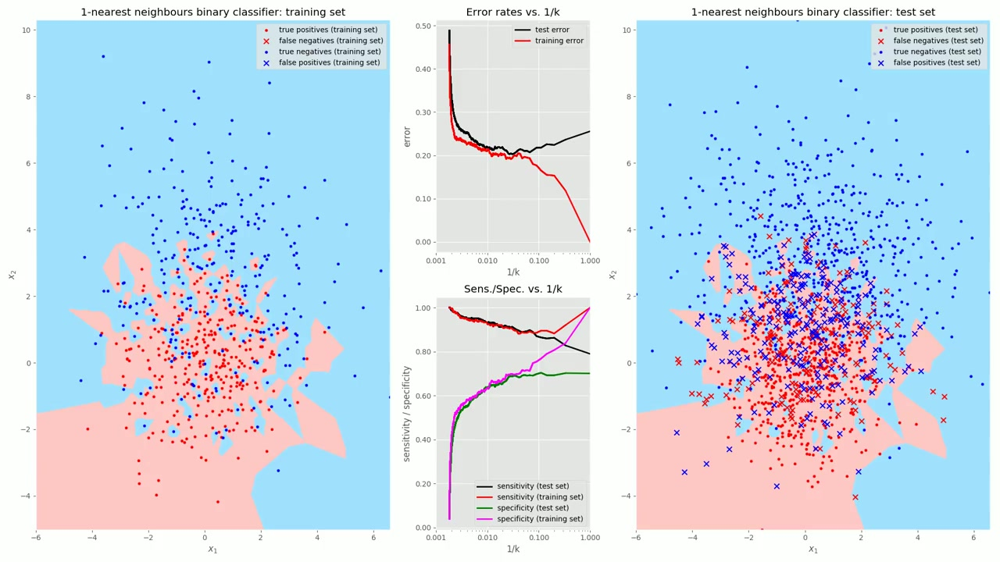

# k-nearest-neighbours-demo

This repo demonstrates some basic concepts of supervised machine learning using a simple binary classifier model on two bivariate Gaussian-distributed points in the xy plane.

A video showing the work in the notebook is [available here](https://youtu.be/bmDdo_5IP2k).

The notebook knn.ipynb contains the main workflow.

To install the dependencies:

````bash
pip install -r requirements.txt
````

Most of the dependencies in requirements.txt are actually needed by Jupyter. The Python code in *knn.ipynb* can be copied into a .py file, and then you only need the following dependencies:

````bash
pip install pandas numpy matplotlib scikit-learn==0.24.02
````

Pictures speak a thousand words, so here's a picture to give an idea what the notebook achieves:




